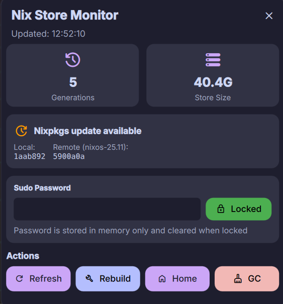

# Nix Monitor



A [DankMaterialShell](https://danklinux.com/) plugin for monitoring Nix store disk usage and system generations with integrated system management capabilities.

## Features

### Bar Widget Display

- Generation count - Shows Nix system generations (configurable)
- Store size - Shows Nix store disk usage (configurable)
- Update status - Check icon shows nixpkgs status:
  - Green: Up-to-date
  - Yellow: Update available
  - Red: Could not fetch version info
- Visual warnings - Icon and text turn red when store exceeds threshold
- Auto-updates - Configurable refresh interval

### Detailed Popout Panel

Click the widget to open a detailed view with:

- Summary cards - Large stat cards for count and store size
- NixOS update status - Shows local and remote nixpkgs revisions with update availability
- Warning banner - Appears when store size exceeds threshold
- **Sudo password input** - Secure password field for commands requiring sudo (stored in memory only)
- Real-time console - View command output as it runs with **selectable text** for easy copying
- Action buttons:
  - Refresh - Update statistics immediately
  - Rebuild - Run your configured rebuild command (requires sudo password if using sudo)
  - Home - Run home-manager switch command (no sudo required)
  - GC - Run your configured garbage collection command (requires sudo password if using sudo)
  - Cancel - Stop running operation
- Clear button - Hide console output

### Configurable Settings

Access via DMS Settings → Plugins → Nix Monitor:

- Show/hide generation count
- Show/hide store size
- Update interval (60-3600 seconds)
- Warning threshold (10-200 GB)
- Enable/disable update checking
- NixOS channel selection (unstable, 24.11, 24.05, 23.11)
- Update check interval (300-86400 seconds)

## Installation

### As a Flake Input

#### For NixOS System Configuration

Add to your NixOS `configuration.nix` flake:

```nix
{
  inputs = {
    nix-monitor = {
      url = "github:antonjah/nix-monitor";
      inputs.nixpkgs.follows = "nixpkgs";
    };
  };

  outputs = { self, nixpkgs, nix-monitor, ... }: {
    nixosConfigurations.hostname = nixpkgs.lib.nixosSystem {
      modules = [
        nix-monitor.nixosModules.default
        {
          programs.nix-monitor = {
            enable = true;

            # Required: customize for your setup
            rebuildCommand = [
              "bash" "-c"
              "sudo nixos-rebuild switch --flake .#hostname 2>&1"
            ];
          };
        }
      ];
    };
  };
}
```

#### For home-manager Configuration

Add to your home-manager `flake.nix`:

```nix
{
  inputs = {
    nix-monitor = {
      url = "github:antonjah/nix-monitor";
      inputs.nixpkgs.follows = "nixpkgs";
    };
  };

  outputs = { self, nixpkgs, home-manager, nix-monitor, ... }: {
    homeConfigurations."youruser" = home-manager.lib.homeManagerConfiguration {
      modules = [
        nix-monitor.homeManagerModules.default
        {
          programs.nix-monitor = {
            enable = true;

            # Required: customize for your setup
            rebuildCommand = [
              "bash" "-c"
              "cd ~/.config/home-manager && home-manager switch --flake .#home 2>&1"
            ];
          };
        }
      ];
    };
  };
}
```

### Activation

#### For NixOS

1. Rebuild your NixOS configuration: `sudo nixos-rebuild switch --flake .#hostname`
2. Restart DMS: `dms restart`
3. Open DMS Settings → Plugins
4. Click "Scan for Plugins"
5. Toggle "Nix Monitor" ON
6. Add to your DankBar layout

#### For home-manager

1. Rebuild your home-manager configuration: `home-manager switch --flake .#home`
2. Restart DMS: `dms restart`
3. Open DMS Settings → Plugins
4. Click "Scan for Plugins"
5. Toggle "Nix Monitor" ON
6. Add to your DankBar layout

### Updating

#### For NixOS

After updating the plugin:

```bash
nix flake update nix-monitor
sudo nixos-rebuild switch --flake .#hostname
rm -rf ~/.cache/quickshell/qmlcache/
dms restart
```

#### For home-manager

After updating the plugin:

```bash
nix flake update nix-monitor
home-manager switch --flake .#home
rm -rf ~/.cache/quickshell/qmlcache/
dms restart
```

**Note:** Due to QML disk caching with Nix symlinks, you must clear the QML cache after plugin updates for changes to take effect.

## Usage

### Bar Widget

- The widget shows in your DankBar with an icon, generation count, and store size
- Click to open the detailed popout panel
- Color changes to red when store exceeds threshold

### Popout Panel

- Refresh - Updates all statistics immediately
- Rebuild - Runs your configured rebuild command (requires sudo password if using `sudo -S`)
- Home - Runs your configured home-manager switch command
- GC - Runs garbage collection (requires sudo password if using `sudo -S`)

### Sudo Password Management

For commands that require sudo privileges:

1. Enter your password in the "Sudo Password" field
2. Click "Set" or press Enter to lock it
3. The button turns green showing "Locked" when password is stored
4. Rebuild and GC buttons become enabled
5. Click "Locked" to clear password from memory
6. Password is only stored in memory and never written to disk

**Security Note:** Use `sudo -S` in your commands to read password from stdin. Example:

```bash
sudo -S nixos-rebuild switch --flake .#hostname 2>&1
```

### Console Output

- Appears automatically when running Rebuild, Home, or GC commands
- Shows real-time stdout/stderr
- **Text is selectable** - Click and drag to select, Ctrl+C to copy
- Auto-scrolls to latest output
- Click "Clear" to hide

## Configuration

The plugin provides sensible defaults for NixOS system monitoring, but **rebuildCommand is required** and must be configured for your specific setup.

### Default Commands

If not overridden, the plugin uses these NixOS defaults:

- `generationsCommand`: Lists system generations from `/nix/var/nix/profiles/system`
- `storeSizeCommand`: Checks `/nix/store` disk usage with `du -sh`
- `gcCommand`: Runs `nix-collect-garbage -d`
- `updateInterval`: 300 seconds (5 minutes)

**Note:** `rebuildCommand` has no default and must be explicitly configured because rebuild commands vary significantly between:

- NixOS with flakes vs without flakes
- home-manager with flakes vs without flakes
- System-wide vs user-specific configurations

### NixOS Module Example (Minimal)

Uses all defaults - only rebuildCommand is required:

```nix
programs.nix-monitor = {
  enable = true;

  # Required: customize for your setup
  rebuildCommand = [
    "bash" "-c"
    "sudo nixos-rebuild switch --flake .#hostname 2>&1"
  ];
};
```

### NixOS Module Example (Full Customization)

```nix
programs.nix-monitor = {
  enable = true;

  rebuildCommand = [
    "bash" "-c"
    "sudo nixos-rebuild switch --flake .#hostname 2>&1"
  ];

  # Use sudo for garbage collection
  gcCommand = [
    "bash" "-c"
    "sudo nix-collect-garbage -d 2>&1"
  ];

  # Check for updates on the 24.11 stable channel
  nixpkgsChannel = "nixos-24.11";

  updateInterval = 600;
};
```

### home-manager Module Example (Minimal)

```nix
programs.nix-monitor = {
  enable = true;

  # Required: customize for your setup
  rebuildCommand = [
    "bash" "-c"
    "cd ~/.config/home-manager && home-manager switch --flake .#home 2>&1"
  ];
};
```

### home-manager Module Example (Full Customization)

```nix
programs.nix-monitor = {
  enable = true;

  # Track home-manager generations instead of system generations
  generationsCommand = [ "sh" "-c" "home-manager generations 2>/dev/null | wc -l" ];

  rebuildCommand = [
    "bash" "-c"
    "cd ~/.config/home-manager && home-manager switch --flake .#home 2>&1"
  ];

  # Optional: customize other settings
  updateInterval = 300;
};
```

### Manual Configuration (config.json)

Alternatively, you can configure the plugin manually by creating `~/.config/DankMaterialShell/plugins/nixMonitor/config.json`:

```json
{
  "generationsCommand": [
    "sh",
    "-c",
    "nixos-rebuild list-generations 2>/dev/null | tail -n +2 | wc -l"
  ],
  "storeSizeCommand": [
    "sh",
    "-c",
    "nix path-info --all --json 2>/dev/null | jq -r '.[].narSize' | awk '{s+=$1} END {printf \"%.1fG\", s/1024/1024/1024}'"
  ],
  "rebuildCommand": [
    "bash",
    "-c",
    "sudo -S nixos-rebuild switch --flake ~/.dotfiles#hostname 2>&1"
  ],
  "homeManagerCommand": [
    "bash",
    "-c",
    "home-manager switch --flake ~/.dotfiles#user@hostname 2>&1"
  ],
  "gcCommand": ["bash", "-c", "sudo -S nix-collect-garbage -d 2>&1"],
  "updateInterval": 300,
  "nixpkgsChannel": "nixos-unstable",
  "gcThresholdGB": 200
}
```

**Note:** Use `sudo -S` for commands requiring sudo to enable password input via the plugin's password field.

You can also manage this via home-manager by symlinking the config:

```nix
home.file.".config/DankMaterialShell/plugins/nixMonitor/config.json".source =
  ./path/to/your/nixMonitor-config.json;
```

### Configuration Options

Both NixOS and home-manager modules use the same `programs.nix-monitor` namespace with identical options.

**Required:**

- `rebuildCommand` - Command to run for system rebuild **(REQUIRED)**

**Optional (with defaults):**

- `generationsCommand` - Command to count system generations
  Default: `nix-env --list-generations --profile /nix/var/nix/profiles/system | wc -l`
- `storeSizeCommand` - Command to get Nix store size
  Default: `du -sh /nix/store | cut -f1`
- `homeManagerCommand` - Command to run home-manager switch (optional, enables Home button)
  Default: None (Home button hidden if not configured)
- `gcCommand` - Command to run for garbage collection
  Default: `nix-collect-garbage -d`
- `updateInterval` - Update interval in seconds
  Default: `300` (5 minutes)
- `localRevisionCommand` - Command to get local nixpkgs revision  
  Default: `nixos-version --hash | cut -c 1-7`
- `remoteRevisionCommand` - Command to get remote nixpkgs revision  
  Default: `git ls-remote https://github.com/NixOS/nixpkgs.git nixos-unstable | cut -c 1-7`  
  **Performance tip:** For faster update checks, use curl with GitHub's API:
  ```nix
  remoteRevisionCommand = [
    "${pkgs.bash}/bin/bash" "-l" "-c"
    "${pkgs.curl}/bin/curl -s https://api.github.com/repos/NixOS/nixpkgs/git/ref/heads/nixos-unstable 2>/dev/null | ${pkgs.jq}/bin/jq -r '.object.sha' 2>/dev/null | cut -c 1-7 || echo 'N/A'"
  ];
  ```
- `nixpkgsChannel` - NixOS channel to check for updates  
  Default: `nixos-unstable` (Options: `nixos-unstable`, `nixos-24.11`, `nixos-24.05`, `nixos-23.11`)

## Requirements

- DankMaterialShell >= 1.0.0
- Nix package manager
- Shell (sh/bash)
- git (for update checking)
- jq (optional, for improved store size calculation)

## Changelog

### Fork Enhancements (stefan-matic)

**New Features:**

- **Sudo Password Input** - Secure in-memory password management for sudo commands
  - Password field with masked input
  - Lock/unlock button with visual indicator
  - Buttons disabled until password is set
  - Password never written to disk
- **Home Manager Support** - New "Home" button for home-manager switch commands
  - Separate `homeManagerCommand` configuration option
  - No sudo required for home-manager operations
- **Selectable Console Output** - Text selection and copying from console output
  - Click and drag to select text
  - Standard keyboard shortcuts (Ctrl+A, Ctrl+C)
  - Improved for copying error messages and logs
- **Improved Store Size Calculation** - More accurate Nix store size using `nix path-info`
  - Shows actual store size instead of filesystem partition size
  - Better suited for systems with separate partitions
- **Enhanced Settings UI** - Fixed DropdownSetting compatibility
  - Replaced non-existent DropdownSetting with StringSetting
  - Works with current DMS version

**Configuration Changes:**

- Commands now support `sudo -S` for stdin password input
- Added `homeManagerCommand` option
- Updated default `storeSizeCommand` to use `nix path-info`
- Updated default `generationsCommand` to use `nixos-rebuild list-generations`

### Original Features (antonjah)

- Real-time Nix store monitoring
- System generation tracking
- NixOS update checking
- Configurable thresholds and intervals
- Console output viewing
- Rebuild and GC buttons

## License

MIT

## Authors

- Anton Andersson ([@antonjah](https://github.com/antonjah)) - Original author
- Stefan Matic ([@stefan-matic](https://github.com/stefan-matic)) - Fork enhancements
